# ui 서브시스템 클래스 다이어그램

## 개요

React 기반 프론트엔드 UI 컴포넌트 구조를 나타냅니다. 각 컴포넌트는 React Functional Component로 구현되어 있습니다.

```mermaid
classDiagram
    direction TB

    %% ==================== External Dependencies ====================
    class Backend["Backend REST API"] {
        <<external>>
        /api/login
        /api/signup
        /api/orders
        /api/coupons
        /api/voice-record
        /api/ingredients
        /api/staffs
        /api/admin/orders
    }

    class LocalStorage["LocalStorage"] {
        <<external>>
        token
        username
        test_users
        test_orders
        test_coupons
        test_ingredients
        test_staffs
    }

    %% ==================== Core Components ====================
    class App {
        <<component>>
        -showLogin: boolean
        -showSignup: boolean
        -isLoggedIn: boolean
        -username: string
        -loginCallback: function
        -hidden: boolean
        +handleLoginSuccess(name): void
        +openLogin(callback): void
        +openSignup(): void
        +closeModals(): void
        +handleLogout(): void
    }

    %% ==================== Common Components ====================
    class NavBar {
        <<component>>
        -couponCount: number
        -countRef: Ref
        -recognitionActiveRef: Ref
        -userRef: Ref
        +handleLogout(): void
        +handleVoice(): void
        +uploadAudioFile(blob): Promise
        +handleProtectedClick(path): void
        +getUserRealName(): Promise
    }

    class ProtectedRoute {
        <<component>>
        +isLoggedIn: boolean
        +username: string
        +adminOnly: boolean
        +children: ReactNode
    }

    class Info {
        <<utility>>
        +ingredients: Map
        +styles: Map
        +defaultStock: Map
        +unitConversion: Map
        +staff: Map
        +calculateItemPrice(): number
        +calculateStylePrice(): number
        +calculateTotalPrice(): number
    }

    %% ==================== Page Components ====================
    class Home {
        <<component>>
        -bannerIndex: number
        -menuIndex: number
        -bannerImages: Array
        -menuSets: Array
    }

    class Story {
        <<component>>
        -lines: Array
    }

    class Menu {
        <<component>>
        -selectedMenu: object
        -showLogin: boolean
        -loginCallback: function
        -hidden: boolean
        +menus: Array
    }

    %% ==================== Modal Components ====================
    class LoginModal {
        <<component>>
        -form: object
        +handleChange(e): void
        +handleSubmit(e): Promise
    }

    class SignupModal {
        <<component>>
        -form: object
        -usernameChecked: boolean
        -usernameExists: boolean
        +handleChange(e): void
        +handleCheckUsername(): Promise
        +handleSubmit(e): Promise
    }

    class OrderModal {
        <<component>>
        -selectedStyle: string
        -selectedDate: string
        -menuItemsData: object
        -stock: object
        -quantities: object
        -wineUnit: string
        -champagneUnit: string
        -coffeeUnit: string
        -showAddons: boolean
        +handleQtyChange(item, delta): void
        +handleAddItem(item): void
        +handleOrder(action): Promise
    }

    %% ==================== Order Components ====================
    class Cart {
        <<component>>
        -cartItems: Array
        -loading: boolean
        -error: string
        -unusedCouponCount: number
        +loadCart(): Promise
        +loadCoupons(): Promise
        +handleDelete(userId, cartedTime): Promise
        +submitOrder(): Promise
        +handleCouponToggle(cartedTime, apply): void
        +canApplyCoupon(cartedTime): boolean
    }

    class OrderHistory {
        <<component>>
        -orders: Array
        -loading: boolean
        -error: string
        +loadOrders(): Promise
        +handleReorder(order): Promise
        +getStatusText(action): string
    }

    %% ==================== Admin Components ====================
    class AdminDashboard {
        <<component>>
    }

    class StockStatus {
        <<component>>
        -quantities: object
        -lastUpdate: string
        +getAuthHeaders(): object
    }

    class OrderForm {
        <<component>>
        -quantities: object
        -orders: Array
        +getAuthHeaders(withJson): object
        +handleChange(key, value): void
        +handleOrder(): Promise
        +handleApplyStock(order): Promise
    }

    class Assign {
        <<component>>
        -orders: Array
        -staff: object
        -loading: boolean
        +loadOrders(): Promise
        +assignStaff(userId, cartedTime, type, staffName): Promise
        +markComplete(userId, cartedTime, type): Promise
        +availableStaff(type): Array
        +getStatusText(action): string
    }

    %% ==================== Component Hierarchy ====================
    App --> NavBar : contains
    App --> Home : routes "/"
    App --> Story : routes "/story"
    App --> Menu : routes "/menu"
    App --> Cart : routes "/order/cart"
    App --> OrderHistory : routes "/order/history"
    App --> AdminDashboard : routes "/admin"
    App --> LoginModal : shows conditionally
    App --> SignupModal : shows conditionally
    App --> ProtectedRoute : wraps protected routes

    Menu --> OrderModal : shows on menu click
    Menu --> LoginModal : shows on login required

    AdminDashboard --> StockStatus : contains
    AdminDashboard --> OrderForm : contains
    AdminDashboard --> Assign : contains

    %% ==================== Utility Dependencies ====================
    NavBar --> Info : uses (isForTest)
    NavBar --> Backend : calls (/api/coupons, /api/users, /api/voice-record)
    NavBar --> LocalStorage : reads/writes

    LoginModal --> Backend : calls (/api/login)
    LoginModal --> LocalStorage : writes (token, username)

    SignupModal --> Backend : calls (/api/signup, /api/signup/check-username, /api/coupons)
    SignupModal --> LocalStorage : reads/writes

    OrderModal --> Info : uses (calculateTotalPrice, unitConversion)
    OrderModal --> Backend : calls (/api/menu, /api/stock, /api/orders)
    OrderModal --> LocalStorage : reads

    Cart --> Info : uses (calculateTotalPrice)
    Cart --> Backend : calls (/api/orders, /api/coupons)
    Cart --> LocalStorage : reads/writes

    OrderHistory --> Info : uses (calculateTotalPrice)
    OrderHistory --> Backend : calls (/api/orders/history)
    OrderHistory --> LocalStorage : reads/writes

    StockStatus --> Info : uses (ingredients)
    StockStatus --> Backend : calls (/api/ingredients)
    StockStatus --> LocalStorage : reads

    OrderForm --> Info : uses (ingredients, defaultStock)
    OrderForm --> Backend : calls (/api/fetch/ingredients_orders)
    OrderForm --> LocalStorage : reads/writes

    Assign --> Info : uses (unitConversion, staff)
    Assign --> Backend : calls (/api/admin/orders/all, /api/staffs, /api/ingredients, /api/coupons)
    Assign --> LocalStorage : reads/writes
```

---

## 컴포넌트 분류

### Core (핵심)
| 컴포넌트 | 설명 |
|---------|------|
| `App` | 애플리케이션 루트 컴포넌트, 라우팅 및 전역 상태 관리 |

### Common (공통)
| 컴포넌트 | 설명 |
|---------|------|
| `NavBar` | 상단 네비게이션 바, 로그인/로그아웃, 음성인식 버튼 |
| `ProtectedRoute` | 인증이 필요한 라우트 보호 컴포넌트 |
| `Info` | 가격 계산, 재고 정보 등 유틸리티 함수/상수 |

### Page (페이지)
| 컴포넌트 | 설명 |
|---------|------|
| `Home` | 메인 홈페이지 (배너, 메뉴 미리보기) |
| `Story` | 브랜드 스토리 페이지 |
| `Menu` | 메뉴 목록 및 선택 페이지 |

### Modal (모달)
| 컴포넌트 | 설명 |
|---------|------|
| `LoginModal` | 로그인 모달 |
| `SignupModal` | 회원가입 모달 |
| `OrderModal` | 주문 상세 및 장바구니 담기 모달 |

### Order (주문)
| 컴포넌트 | 설명 |
|---------|------|
| `Cart` | 장바구니 페이지, 쿠폰 적용, 주문하기 |
| `OrderHistory` | 주문 내역 페이지, 재주문 기능 |

### Admin (관리자)
| 컴포넌트 | 설명 |
|---------|------|
| `AdminDashboard` | 관리자 대시보드 레이아웃 |
| `StockStatus` | 실시간 재고 현황 표시 |
| `OrderForm` | 재고 주문 및 반영 |
| `Assign` | 조리/배달 직원 배정 및 상태 관리 |

---

## Backend API 연동

| 컴포넌트 | 사용 API |
|---------|----------|
| `NavBar` | GET /api/coupons, GET /api/users, POST /api/voice-record |
| `LoginModal` | POST /api/login |
| `SignupModal` | POST /api/signup, POST /api/signup/check-username, POST /api/coupons |
| `OrderModal` | GET /api/menu, GET /api/stock, POST /api/orders |
| `Cart` | GET /api/orders, DELETE /api/orders, PUT /api/orders, POST /api/coupons |
| `OrderHistory` | GET /api/orders/history, POST /api/orders |
| `StockStatus` | GET /api/ingredients |
| `OrderForm` | GET /api/fetch/ingredients_orders, POST /api/fetch/ingredients_orders, PUT /api/fetch/ingredients_orders |
| `Assign` | GET /api/admin/orders/all, GET /api/staffs, POST /api/staffs, POST /api/admin/orders, POST /api/ingredients, POST /api/coupons |

---

## 상태 관리

이 프로젝트는 별도의 상태 관리 라이브러리(Redux, Zustand 등)를 사용하지 않고, React의 기본 `useState`, `useEffect` 훅과 props drilling을 통해 상태를 관리합니다.

### 전역 상태 (App에서 관리)
- `isLoggedIn`: 로그인 상태
- `username`: 현재 로그인된 사용자명
- `showLogin`, `showSignup`: 모달 표시 여부

### 로컬 스토리지 활용
테스트 모드(`isForTest = true`)에서는 백엔드 대신 localStorage를 사용하여 데이터를 저장/조회합니다.
- `test_users`: 테스트용 사용자 정보
- `test_orders`: 테스트용 주문 정보
- `test_coupons`: 테스트용 쿠폰 정보
- `test_ingredients`: 테스트용 재고 정보
- `test_staffs`: 테스트용 직원 정보
