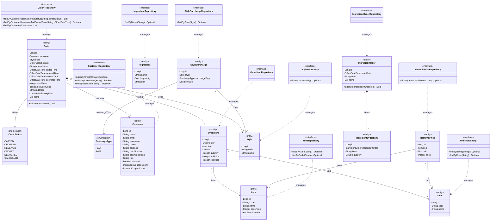

# db 서브시스템 클래스 다이어그램

```mermaid
classDiagram
    direction TB

    %% ==================== Enumerations ====================
    class OrderStatus {
        <<enumeration>>
        CARTED
        ORDERED
        RECEIVED
        COOKED
        DELIVERED
        CANCELLED
    }

    class SurchargeType {
        <<enumeration>>
        FLAT
        RATE
    }

    %% ==================== Entities ====================
    class Customer {
        <<entity>>
        -Long id
        -String name
        -String email
        -String username
        -String phone
        -String address
        -String cardNumber
        -String passwordHash
        -String role
        -boolean enabled
        -int unusedCouponCount
        -int usedCouponCount
    }

    class Order {
        <<entity>>
        -Long id
        -Customer customer
        -Style style
        -OrderStatus status
        -String menuName
        -OffsetDateTime cartedTime
        -OffsetDateTime orderedTime
        -OffsetDateTime cookedTime
        -OffsetDateTime deliveredTime
        -Integer totalPrice
        -boolean couponUsed
        -String address
        -LocalDate deliveryDate
        -List items
        +addItem(OrderItem) void
    }

    class OrderItem {
        <<entity>>
        -Long id
        -Order order
        -Item item
        -Unit unit
        -Integer quantity
        -Integer unitPrice
        -Integer linePrice
    }

    class Item {
        <<entity>>
        -Long id
        -String code
        -String name
        -Integer basePrice
        -Boolean isActive
    }

    class Unit {
        <<entity>>
        -Long id
        -String code
        -String name
    }

    class Style {
        <<entity>>
        -Long id
        -String code
        -String name
    }

    class StyleSurcharge {
        <<entity>>
        -Long id
        -Style style
        -SurchargeType surchargeType
        -Double value
    }

    class ItemUnitPrice {
        <<entity>>
        -Long id
        -Item item
        -Unit unit
        -Integer price
    }

    class Ingredient {
        <<entity>>
        -Long id
        -String name
        -Double quantity
        -String unit
    }

    class IngredientOrder {
        <<entity>>
        -Long id
        -OffsetDateTime orderDate
        -String state
        -List items
        +addItem(IngredientOrderItem) void
    }

    class IngredientOrderItem {
        <<entity>>
        -Long id
        -IngredientOrder ingredientOrder
        -String item
        -Double quantity
    }

    %% ==================== Repositories ====================
    class CustomerRepository {
        <<interface>>
        +existsByEmail(String) boolean
        +existsByUsername(String) boolean
        +findByUsername(String) Optional
    }

    class OrderRepository {
        <<interface>>
        +findByCustomerUsernameAndStatus(String, OrderStatus) List
        +findByCustomerUsernameAndCartedTime(String, OffsetDateTime) Optional
        +findByCustomer(Customer) List
    }

    class OrderItemRepository {
        <<interface>>
    }

    class ItemRepository {
        <<interface>>
        +findByName(String) Optional
        +findByCode(String) Optional
    }

    class UnitRepository {
        <<interface>>
        +findByName(String) Optional
        +findByCode(String) Optional
    }

    class StyleRepository {
        <<interface>>
        +findByCode(String) Optional
    }

    class StyleSurchargeRepository {
        <<interface>>
        +findByStyle(Style) Optional
    }

    class ItemUnitPriceRepository {
        <<interface>>
        +findByItemAndUnit(Item, Unit) Optional
    }

    class IngredientRepository {
        <<interface>>
        +findByName(String) Optional
    }

    class IngredientOrderRepository {
        <<interface>>
    }

    %% ==================== Entity Relationships ====================
    Order "*" --> "1" Customer : customer
    Order "*" --> "1" Style : style
    Order "1" *-- "*" OrderItem : items
    Order --> OrderStatus : status

    OrderItem "*" --> "1" Item : item
    OrderItem "*" --> "1" Unit : unit

    StyleSurcharge "1" --> "1" Style : style
    StyleSurcharge --> SurchargeType : surchargeType

    ItemUnitPrice "*" --> "1" Item : item
    ItemUnitPrice "*" --> "1" Unit : unit

    IngredientOrder "1" *-- "*" IngredientOrderItem : items

    %% ==================== Repository to Entity ====================
    CustomerRepository ..> Customer : manages
    OrderRepository ..> Order : manages
    OrderItemRepository ..> OrderItem : manages
    ItemRepository ..> Item : manages
    UnitRepository ..> Unit : manages
    StyleRepository ..> Style : manages
    StyleSurchargeRepository ..> StyleSurcharge : manages
    ItemUnitPriceRepository ..> ItemUnitPrice : manages
    IngredientRepository ..> Ingredient : manages
    IngredientOrderRepository ..> IngredientOrder : manages
```
