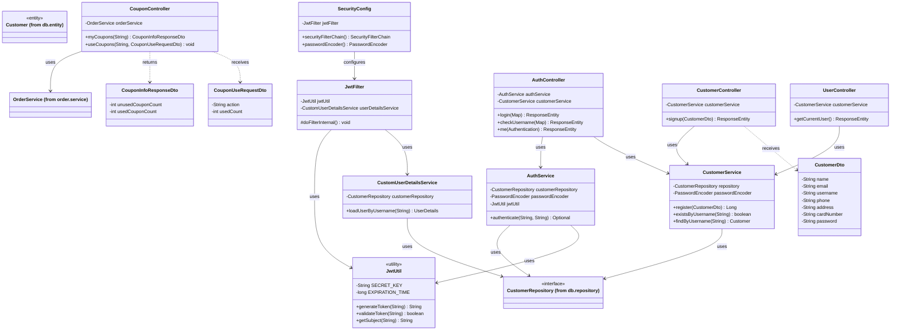

# account 서브시스템 클래스 다이어그램

```mermaid
classDiagram
    direction TB

    %% ==================== External Classes ====================
    class Customer["Customer (from db.entity)"] {
        <<entity>>
    }

    class CustomerRepository["CustomerRepository (from db.repository)"] {
        <<interface>>
    }

    class OrderService["OrderService (from order.service)"] {
    }

    %% ==================== DTOs ====================
    class CustomerDto {
        -String name
        -String email
        -String username
        -String phone
        -String address
        -String cardNumber
        -String password
    }

    class CouponInfoResponseDto {
        -int unusedCouponCount
        -int usedCouponCount
    }

    class CouponUseRequestDto {
        -String action
        -int usedCount
    }

    %% ==================== Security ====================
    class JwtUtil {
        <<utility>>
        -String SECRET_KEY
        -long EXPIRATION_TIME
        +generateToken(String) String
        +validateToken(String) boolean
        +getSubject(String) String
    }

    class JwtFilter {
        -JwtUtil jwtUtil
        -CustomUserDetailsService userDetailsService
        #doFilterInternal() void
    }

    class CustomUserDetailsService {
        -CustomerRepository customerRepository
        +loadUserByUsername(String) UserDetails
    }

    class SecurityConfig {
        -JwtFilter jwtFilter
        +securityFilterChain() SecurityFilterChain
        +passwordEncoder() PasswordEncoder
    }

    %% ==================== Services ====================
    class AuthService {
        -CustomerRepository customerRepository
        -PasswordEncoder passwordEncoder
        -JwtUtil jwtUtil
        +authenticate(String, String) Optional
    }

    class CustomerService {
        -CustomerRepository repository
        -PasswordEncoder passwordEncoder
        +register(CustomerDto) Long
        +existsByUsername(String) boolean
        +findByUsername(String) Customer
    }

    %% ==================== Controllers ====================
    class AuthController {
        -AuthService authService
        -CustomerService customerService
        +login(Map) ResponseEntity
        +checkUsername(Map) ResponseEntity
        +me(Authentication) ResponseEntity
    }

    class CustomerController {
        -CustomerService customerService
        +signup(CustomerDto) ResponseEntity
    }

    class CouponController {
        -OrderService orderService
        +myCoupons(String) CouponInfoResponseDto
        +useCoupons(String, CouponUseRequestDto) void
    }

    class UserController {
        -CustomerService customerService
        +getCurrentUser() ResponseEntity
    }

    %% ==================== Relationships ====================
    JwtFilter --> JwtUtil : uses
    JwtFilter --> CustomUserDetailsService : uses
    SecurityConfig --> JwtFilter : configures
    CustomUserDetailsService --> CustomerRepository : uses

    AuthService --> CustomerRepository : uses
    AuthService --> JwtUtil : uses
    CustomerService --> CustomerRepository : uses

    AuthController --> AuthService : uses
    AuthController --> CustomerService : uses
    CustomerController --> CustomerService : uses
    CouponController --> OrderService : uses
    UserController --> CustomerService : uses

    CustomerController ..> CustomerDto : receives
    CouponController ..> CouponInfoResponseDto : returns
    CouponController ..> CouponUseRequestDto : receives
```
