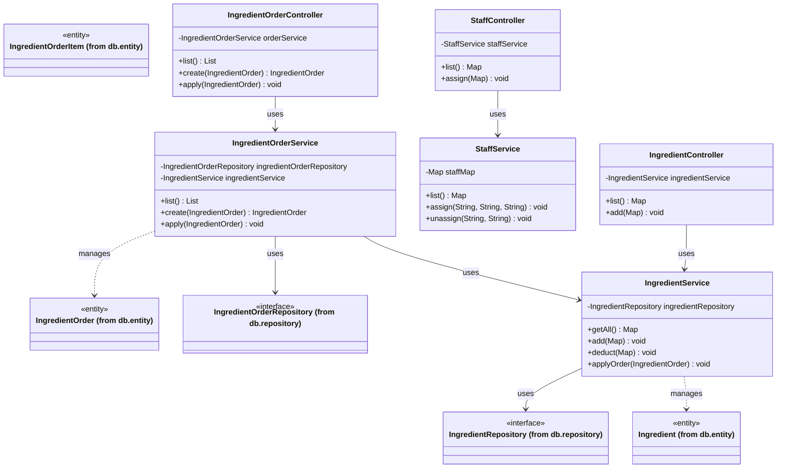

# management 서브시스템 클래스 다이어그램

```mermaid
classDiagram
    direction TB

    %% ==================== External Classes ====================
    class Ingredient["Ingredient (from db.entity)"] {
        <<entity>>
    }
    class IngredientOrder["IngredientOrder (from db.entity)"] {
        <<entity>>
    }
    class IngredientOrderItem["IngredientOrderItem (from db.entity)"] {
        <<entity>>
    }

    class IngredientRepository["IngredientRepository (from db.repository)"] {
        <<interface>>
    }
    class IngredientOrderRepository["IngredientOrderRepository (from db.repository)"] {
        <<interface>>
    }

    %% ==================== Services ====================
    class IngredientService {
        -IngredientRepository ingredientRepository
        +getAll() Map
        +add(Map) void
        +deduct(Map) void
        +applyOrder(IngredientOrder) void
    }

    class IngredientOrderService {
        -IngredientOrderRepository ingredientOrderRepository
        -IngredientService ingredientService
        +list() List
        +create(IngredientOrder) IngredientOrder
        +apply(IngredientOrder) void
    }

    class StaffService {
        -Map staffMap
        +list() Map
        +assign(String, String, String) void
        +unassign(String, String) void
    }

    %% ==================== Controllers ====================
    class IngredientController {
        -IngredientService ingredientService
        +list() Map
        +add(Map) void
    }

    class IngredientOrderController {
        -IngredientOrderService orderService
        +list() List
        +create(IngredientOrder) IngredientOrder
        +apply(IngredientOrder) void
    }

    class StaffController {
        -StaffService staffService
        +list() Map
        +assign(Map) void
    }

    %% ==================== Relationships ====================
    IngredientService --> IngredientRepository : uses
    IngredientOrderService --> IngredientOrderRepository : uses
    IngredientOrderService --> IngredientService : uses

    IngredientController --> IngredientService : uses
    IngredientOrderController --> IngredientOrderService : uses
    StaffController --> StaffService : uses

    IngredientService ..> Ingredient : manages
    IngredientOrderService ..> IngredientOrder : manages
```
