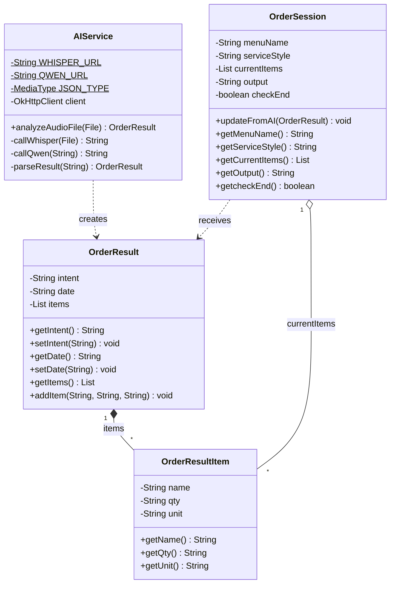

# ai 서브시스템 클래스 다이어그램

```mermaid
classDiagram
    direction TB

    %% ==================== Classes ====================
    class AIService {
        -String WHISPER_URL$
        -String QWEN_URL$
        -MediaType JSON_TYPE$
        -OkHttpClient client
        +analyzeAudioFile(File) OrderResult
        -callWhisper(File) String
        -callQwen(String) String
        -parseResult(String) OrderResult
    }

    class OrderResult {
        -String intent
        -String date
        -List items
        +getIntent() String
        +setIntent(String) void
        +getDate() String
        +setDate(String) void
        +getItems() List
        +addItem(String, String, String) void
    }

    class OrderResultItem {
        -String name
        -String qty
        -String unit
        +getName() String
        +getQty() String
        +getUnit() String
    }

    class OrderSession {
        -String menuName
        -String serviceStyle
        -List currentItems
        -String output
        -boolean checkEnd
        +updateFromAI(OrderResult) void
        +getMenuName() String
        +getServiceStyle() String
        +getCurrentItems() List
        +getOutput() String
        +getcheckEnd() boolean
    }

    %% ==================== Relationships ====================
    AIService ..> OrderResult : creates
    OrderResult "1" *-- "*" OrderResultItem : items
    OrderSession "1" o-- "*" OrderResultItem : currentItems
    OrderSession ..> OrderResult : receives
```
