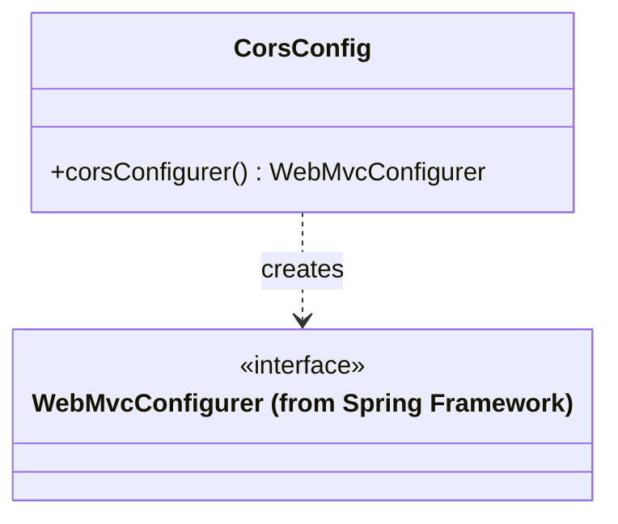

# config 서브시스템 클래스 다이어그램

```mermaid
classDiagram
    direction TB

    class CorsConfig {
        +corsConfigurer() WebMvcConfigurer
    }

    class WebMvcConfigurer["WebMvcConfigurer (from Spring Framework)"] {
        <<interface>>
    }

    CorsConfig ..> WebMvcConfigurer : creates
```
