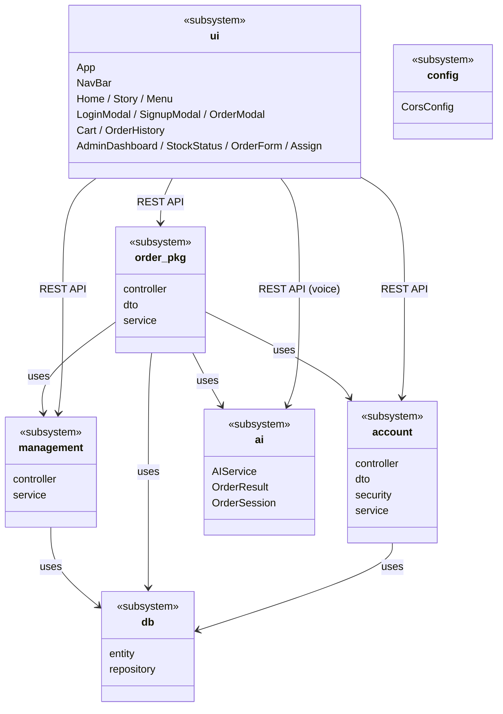
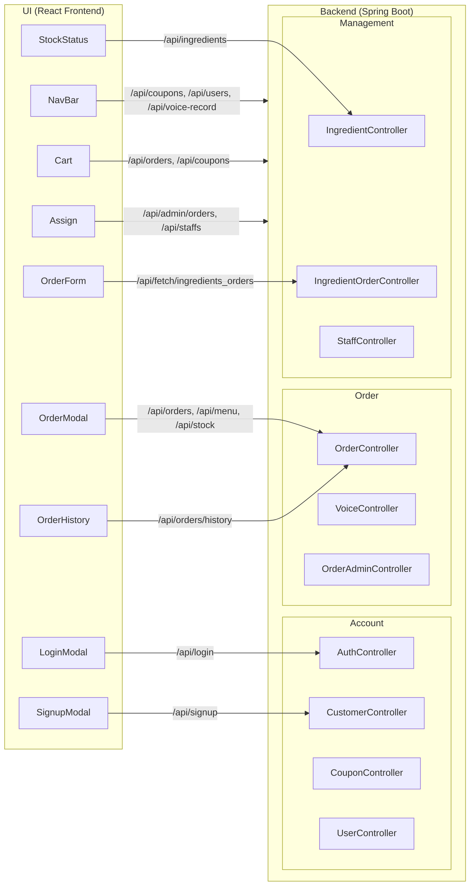

# 전체 서브시스템 의존관계 다이어그램

---

## UI - Backend 연동 상세

---

## 서브시스템 역할 요약

| 서브시스템 | 역할 |
|-----------|------|
| **UI** | 사용자 인터페이스 (React SPA) - 로그인/회원가입, 메뉴 주문, 장바구니, 주문내역, 관리자 대시보드 |
| **Account** | 사용자 인증 (JWT), 회원가입, 쿠폰 관리 |
| **Order** | 주문 생성/조회/수정, 장바구니, 음성 주문 처리 |
| **Management** | 재고 관리, 재료 주문, 직원 배정 |
| **AI** | 음성 파일 → 텍스트 변환 (Whisper), 의도 분석 (Qwen) |
| **DB** | 영속성 계층 (JPA Entity, Repository) |
| **Config** | Spring 설정 (CORS 등) |
